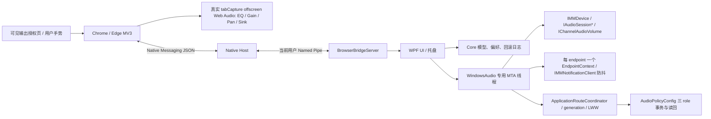

# 架构

`AudioSourceMixer.Core` 包含不可变模型、服务接口、配置、回滚日志、浏览器协议和 Named Pipe 服务。`WindowsAudio` 是唯一持有 Core Audio COM 对象的层；`Desktop` 只消费快照和服务接口。普通 Windows session 始终使用原生 0–100% 音量，不存在运行时 PCM 捕获/重放 helper，也不伪装支持逐会话 EQ。Chrome/Edge 只有在用户主动捕获标签页后才使用 0–200% Web Audio 图。

## 路由一致性

普通应用的持久 profile 仍按可执行文件稳定身份匹配；本次运行的路由事务再加入 PID 和进程启动时间，防止 PID 复用。所有 sibling session 共享同一 coordinator slot。请求 generation、取消令牌和单 slot gate 提供 last-write-wins；同目标请求幂等。策略写入后读取三个 role，并同时观察所有活动 endpoint。只有全部活动流在目标并稳定 750 ms 才进入 `Applied`，没有活动流或旧流不迁移则保留策略并进入 `PendingStreamRestart`。

第一次修改会话或路由前，WindowsAudio 将原生音量、静音、声道值、三个持久 role 和安全进程身份写入 `rollback.json`。恢复校验 PID、路径和进程开始时间。恢复流程不会等待应用立刻迁移流，也不会因等待超时撤销已确认的策略。

## 配置与浏览器

`profiles.json` schemaVersion 3 保存来源类型及浏览器 EQ。普通来源最大值为 1 且 `SupportsEqualizer=false`，浏览器来源最大值为 2；schema 2 浏览器配置迁移为 EQ 关闭。单项恢复关闭该来源 EQ 并删除对应 stable key；全部恢复在一个 guarded 流程中取消防抖/路由，恢复音频和浏览器图，清除配置及内存应用状态。“记住应用设置”关闭时采用“保留但忽略”语义。

浏览器输出授权把系统选择结果先作为内存候选；只有用户播放低音量测试声并明确确认后才持久化 browser + Windows endpoint ID 到 browser deviceId/label/groupId 的映射。每个实际捕获标签页持有独立的 `MediaStreamAudioSourceNode → 10×BiquadFilterNode → headroom GainNode → 主音量 GainNode → StereoPannerNode → AnalyserNode → destination` 固定图；EQ 更新不重建 capture、context 或 sink，关闭时全部频段归零且 headroom 为 1。offscreen 只对该 `AudioContext` 调用 `setSinkId()` 并回读 `sinkId`。空闲 service worker 不连接 Native Host，Native Host 也不会启动桌面程序。

## 安装边界

安装器用同卷 staging → backup → target 原子提交。安装路径贯穿快捷方式、Native Messaging、卸载项和启动项；卸载前同时校验 `install-identity.json` 与注册表 `InstallLocation`。发行负载由机器可读 allowlist 组装，开发文档、测试、探针和构建机路径不进入用户目录。
